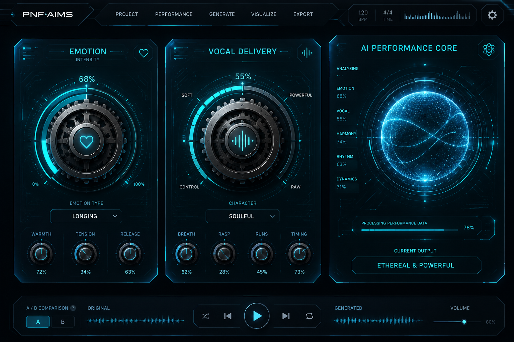
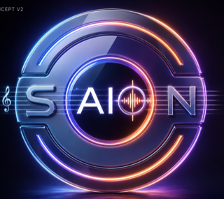

# Visual Appendix: Wireframes And Early Concepts

## Purpose

This appendix gathers early visual assets used to support postmortem discussion of SAION's initial interface direction and aesthetic foundations.

## Wireframe-Style And Concept Images

### 1. PNF-AIMS Interface Concept Board

Source: [gui/public/images/logos/buttons.png](../../gui/public/images/logos/buttons.png)

### 2. SAION Logo Concept Board With UI Mockups

Source: [gui/public/images/logos/SAION%20LOGO_App.png](../../gui/public/images/logos/SAION%20LOGO_App.png)

### 3. SAION Core Brand Mark Reference

Source: [gui/public/images/logos/SAION.png](../../gui/public/images/logos/SAION.png)

## Interpretation Notes

1. The images show an early commitment to a futuristic and performance-centered control aesthetic.
2. Dial-based interaction metaphors and visualized performance telemetry appear early in concept work.
3. Branding and UI language developed in parallel, reinforcing product identity from the start.
